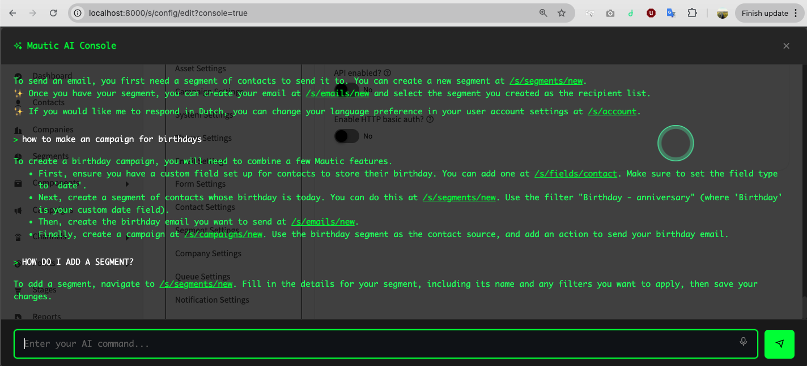

# Mautic AI Console Bundle


An AI-powered console interface for Mautic with voice input, intelligent assistance, and tool integration. Chat with your Mautic instance using natural language!

## Overview

The Mautic AI Console Bundle provides an intelligent assistant that helps users interact with their Mautic instance through natural language. Ask questions about your data, get help with configuration, or execute actions - all through a conversational interface.



## Features

- **Natural Language Interface** - Chat with Mautic in plain language
- **Voice Input Support** - Speak to the AI using speech-to-text (Whisper integration)
- **Context-Aware** - Knows your name, language, and Mautic version
- **Conversation History** - Maintains context across multiple messages
- **Tool Integration** - Can execute actions in Mautic (contacts, segments, cache, etc.)
- **Customizable AI Model** - Choose from available models (GPT-4, Claude, etc.)
- **Custom Instructions** - Define system prompts to control AI behavior
- **Multi-language Support** - Responds in the user's preferred language

## Requirements

- Mautic 4.0+ or Mautic 5.0+
- PHP 7.4 or 8.0+
- **Mautic AI Connection Bundle** (required dependency)
- A configured LiteLLM instance or OpenAI API access

## Installation

### Via Composer

```bash
composer require mautic/ai-console-bundle
```

This will automatically install the required `mautic/ai-connection-bundle` dependency.

### Manual Installation

1. First, install the **Mautic AI Connection Bundle** (required)
2. Download or clone this repository
3. Place the `MauticAiConsoleBundle` folder in `docroot/plugins/`
4. Clear Mautic cache:
   ```bash
   php bin/console cache:clear
   ```
5. Go to Mautic Settings → Plugins
6. Click "Install/Upgrade Plugins"
7. Find "Mautic AI Console" and publish it

## Dependencies

### Mautic AI Connection Bundle (Required)

This plugin **requires** the [Mautic AI Connection Bundle](../MauticAIconnectionBundle/README.md) to function. The AI Connection Bundle provides:
- LiteLLM service integration
- Centralized AI configuration (endpoint and API keys)
- Model management

**Important:** Configure the AI Connection Bundle first before using the AI Console!

## Configuration

Navigate to **Mautic Settings → Plugins → Mautic AI Console** to configure the plugin.

### Basic Settings

#### 1. AI Console Enabled
Enable or disable the AI Console interface.

#### 2. AI Model
Select which AI model to use for the console:
- GPT-4 (most capable, slower)
- GPT-3.5 Turbo (fast, cost-effective)
- Claude 3 Sonnet/Haiku/Opus
- Other models available in your LiteLLM instance

**Note:** The AI Console and AI Reports can use different models independently.

#### 3. Pre-prompt (System Instructions)

The pre-prompt is **critical** for controlling the AI's behavior. This is where you define:
- The AI's personality and role
- Output format (HTML, markdown, plain text)
- Language preferences
- Available context (user info, Mautic version)
- Behavioral guidelines

**Default Pre-prompt Example:**

```
CONTEXT:
--------------
Your name is Mattias. You are the Mautic helper and you run inside the Mautic AI console.

You are helping the following user:
User firstname: {account_firstname}
User Lastname: {account_lastname}
User Email: {account_email}

OUTPUT
------------
You may use the following HTML tags: <a>, <i>, <b>, <ul>, <li>, <p>
You don't return Markdown, you return HTML.
If you link to a URL (e.g., /s/dashboard), link to it like this: <a href="/s/dashboard">/s/dashboard</a>

You always try to answer in short sentences or limited paragraphs, only elaborate when explicitly asked.

You answer in {language}

Instructions:
-----------------
You are a professional helpful Mautic assistant. You help users with their marketing automation tasks.
You answer in a professional manner, without repeating the question and in a brief manner.

You can help with:
1. Answering questions based on Mautic documentation
2. Triggering tool calls when needed

If you are asked commands or things you cannot do, just say: "This feature is not supported. I'm sorry."
```

#### Available Tokens in Pre-prompt

- `{language}` - User's interface language (e.g., "English", "French")
- `{account_firstname}` - User's first name
- `{account_lastname}` - User's last name
- `{account_email}` - User's email address
- `{mautic_version}` - Current Mautic version

### Importance of a Good Pre-prompt

The pre-prompt is **the most important configuration** for the AI Console. A well-crafted pre-prompt will:

✅ **Define personality** - Is the AI formal, friendly, technical, or casual?
✅ **Control output format** - HTML vs Markdown vs plain text
✅ **Set boundaries** - What the AI can and cannot do
✅ **Provide context** - User info, system capabilities, documentation
✅ **Ensure consistency** - Same behavior across all users
✅ **Improve accuracy** - Clear instructions = better responses

**Tips for Writing Good Pre-prompts:**

1. **Be specific about output format**
   ```
   ❌ Bad: "Answer questions"
   ✅ Good: "Answer in 2-3 sentences using HTML tags only. No markdown."
   ```

2. **Define the AI's role clearly**
   ```
   ❌ Bad: "You are helpful"
   ✅ Good: "You are a Mautic technical expert who helps with marketing automation"
   ```

3. **Set response length expectations**
   ```
   ❌ Bad: "Answer questions"
   ✅ Good: "Keep answers under 100 words unless the user asks for more detail"
   ```

4. **Include relevant documentation or context**
   ```
   ✅ Good: Include key Mautic paths like /s/contacts, /s/campaigns, etc.
   ```

5. **Handle edge cases**
   ```
   ✅ Good: "If asked about features you're unsure about, direct users to the official documentation"
   ```

### Speech-to-Text Settings

#### Enable Speech-to-Text
Toggle voice input functionality.

#### Speech-to-Text Model
Select the model for speech recognition:
- whisper-1 (OpenAI Whisper)
- Other speech models available in your LiteLLM instance

**Note:** Speech-to-text requires audio transcription support in your LiteLLM configuration.

### Tool Configuration

Enable or disable specific tools that the AI can execute:

- **Clear Cache Tool** - Allow AI to clear Mautic cache
- **Create Contact Tool** - Allow AI to create contacts
- **Create Segment Tool** - Allow AI to create segments

**Security Note:** Only enable tools you want the AI to have access to. Disabled tools won't be available to the AI.

## Usage

### Accessing the Console

Once configured, the AI Console button appears in the Mautic toolbar (top right).

### Asking Questions

**Examples:**
- "How many contacts do I have?"
- "Show me recent campaigns"
- "How do I create a segment?"
- "What's the difference between a segment and a tag?"
- "Navigate to the email builder"

### Using Voice Input

1. Click the microphone icon in the AI Console
2. Speak your question
3. The AI will transcribe and respond

### Using Tools

When enabled, the AI can execute actions:

**Example:**
- User: "Create a contact named John Doe with email john@example.com"
- AI: Executes the Create Contact tool
- AI: "✅ Contact created successfully: John Doe (john@example.com)"

## Architecture

```
┌─────────────────────────────────────┐
│     Mautic AI Console Bundle        │
│                                     │
│  ┌─────────────────────────────┐   │
│  │  Console Controller         │   │
│  │  - Process messages         │   │
│  │  - Handle voice input       │   │
│  │  - Tool execution           │   │
│  │  - Conversation history     │   │
│  └─────────────────────────────┘   │
└─────────────────────────────────────┘
              ↓ depends on
┌─────────────────────────────────────┐
│   Mautic AI Connection Bundle       │
│  ┌───────────────────────────────┐  │
│  │   LiteLLM Service             │  │
│  │  - Chat API                   │  │
│  │  - Speech-to-text API         │  │
│  └───────────────────────────────┘  │
└─────────────────────────────────────┘
              ↓ connects to
┌─────────────────────────────────────┐
│       LiteLLM Proxy Server          │
│  (Routes to OpenAI, Claude, etc.)   │
└─────────────────────────────────────┘
```

## Advanced Configuration

### Custom Tools

Create custom tools by extending the tool system:

1. Create a new tool class in `Tools/` directory:

```php
<?php
namespace MauticPlugin\MauticAiConsoleBundle\Tools;

class MyCustomTool
{
    public function getTitle(): string
    {
        return 'My Custom Tool';
    }

    public function getDescription(): string
    {
        return 'Description of what this tool does';
    }

    public function getParameters(): array
    {
        return [
            'param1' => [
                'type' => 'string',
                'description' => 'Parameter description',
                'required' => true,
            ],
        ];
    }

    public function execute(array $arguments): array
    {
        // Tool logic here
        return [
            'success' => true,
            'message' => 'Tool executed successfully',
        ];
    }
}
```

2. The tool will automatically appear in plugin settings
3. Enable it to make it available to the AI

### Conversation Context

The AI Console maintains the last 7 conversation turns for context. This allows:
- Follow-up questions
- Contextual understanding
- Multi-turn conversations

Example conversation:
```
User: "How many contacts do I have?"
AI: "You have 1,234 contacts in your database."
User: "How many are subscribed?"  ← AI remembers we're talking about contacts
AI: "892 contacts are subscribed to your emails."
```

## Troubleshooting

### Console button not appearing

**Solution:**
1. Ensure plugin is published
2. Enable "AI Console Enabled" in settings
3. Clear cache

### "LiteLLM endpoint must be configured" error

**Solution:** Configure the **Mautic AI Connection Bundle** first with your LiteLLM endpoint and credentials.

### AI responses are in the wrong language

**Solution:** Update the pre-prompt to use `{language}` token and ensure your Mautic user profile has the correct language set.

### Speech-to-text not working

**Solution:**
1. Enable "Speech-to-Text Enabled" in settings
2. Ensure your LiteLLM instance supports audio transcription
3. Check browser microphone permissions

### AI gives incorrect answers

**Solution:** Improve your pre-prompt:
- Add more specific instructions
- Include relevant Mautic documentation snippets
- Define output format more clearly
- Set behavior boundaries

### Tools not executing

**Solution:**
1. Ensure tools are enabled in plugin settings
2. Check that the AI's pre-prompt mentions tool capabilities
3. Verify user has necessary permissions in Mautic

## Development

### Adding Documentation to Pre-prompt

You can include Mautic documentation in the pre-prompt to improve accuracy:

```
DOCUMENTATION
---------------------
Contacts: /s/contacts - View all contacts
Segments: /s/segments - Create and manage segments
Campaigns: /s/campaigns - Marketing automation campaigns
...
```

### Testing Tools

Test tool execution:

```php
$tool = new CreateContactTool($leadModel, $translator);
$result = $tool->execute([
    'firstname' => 'Test',
    'lastname' => 'User',
    'email' => 'test@example.com',
]);
```

## Best Practices

1. **Start with a detailed pre-prompt** - Spend time crafting clear instructions
2. **Test with different models** - GPT-4 vs GPT-3.5 behave differently
3. **Enable only needed tools** - Limit AI capabilities for security
4. **Include user context** - Use tokens like `{account_firstname}` for personalization
5. **Monitor conversations** - Check AI logs to improve prompts
6. **Keep responses concise** - Configure AI to be brief by default
7. **Use HTML formatting** - Makes responses more readable in the console

## Security Considerations

- API keys are encrypted and stored securely via AI Connection Bundle
- Tools execute with the current user's permissions
- Conversation history is user-specific
- Only enabled tools are available to the AI
- All AI requests include Mautic instance fingerprint for tracking

## Support

- GitHub Issues: [Report an issue](https://github.com/yourusername/mauticorangepoc/issues)
- Mautic Community: [community.mautic.org](https://community.mautic.org)
- AI Connection Bundle: [See documentation](../MauticAIconnectionBundle/README.md)

## License

GPL-3.0-or-later

## Credits

Created by Frederik Wouters and the Mautic Community

## Version

1.0.0

## Changelog

### 1.0.0 (2024)
- Initial release
- Natural language interface
- Voice input support (Speech-to-text)
- Conversation history
- Tool integration (contacts, segments, cache)
- Customizable AI models
- Multi-language support
- Custom pre-prompt configuration
- User context tokens
